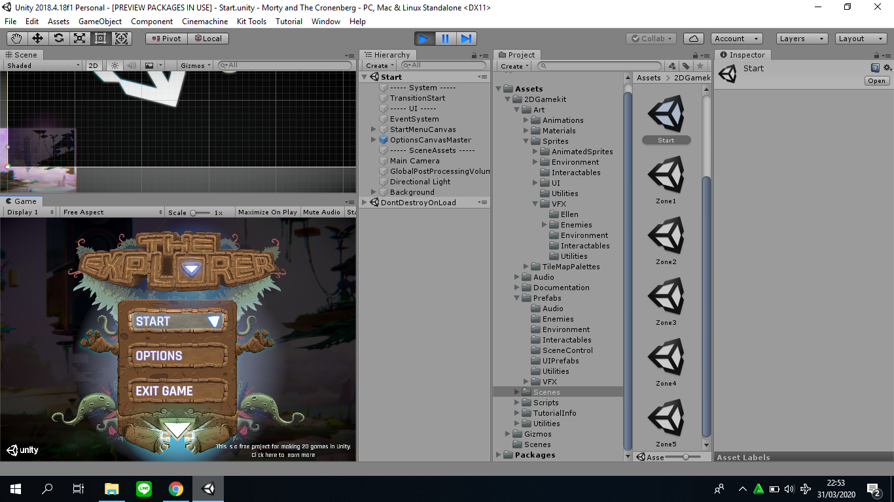
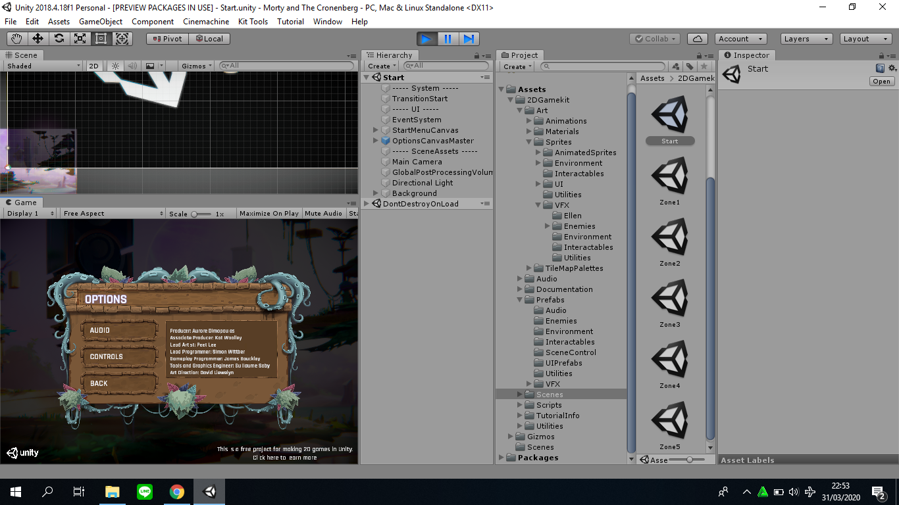
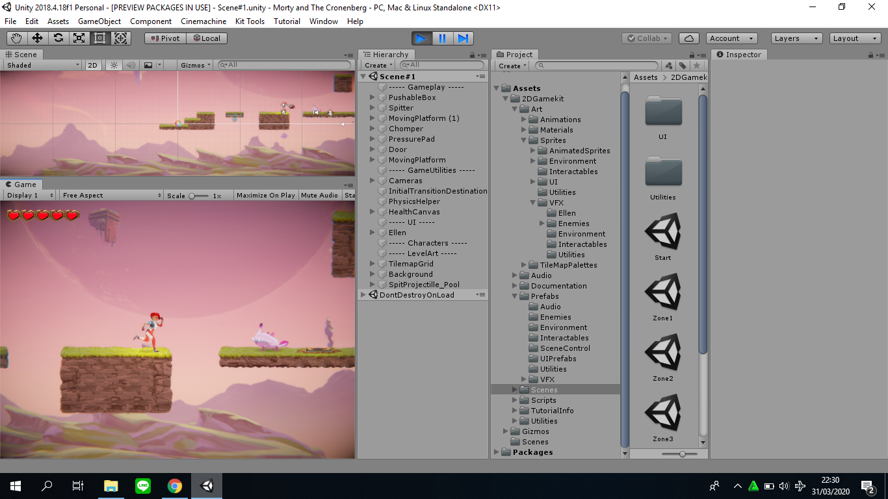
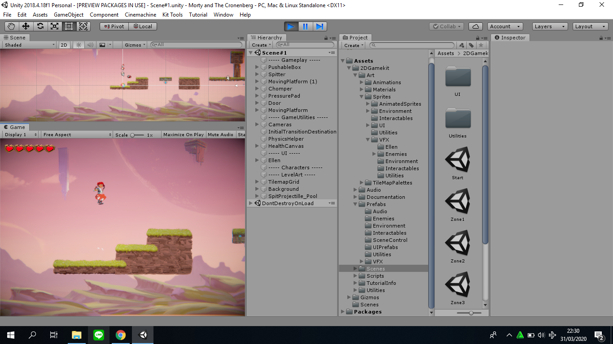
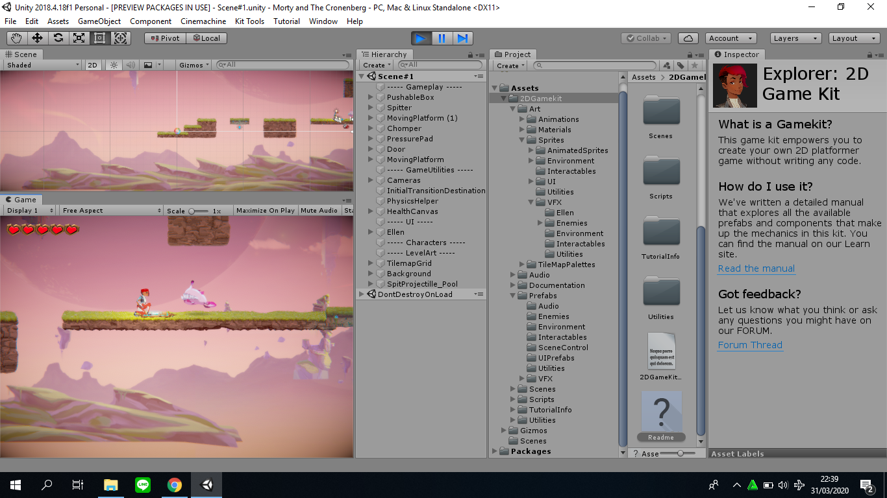
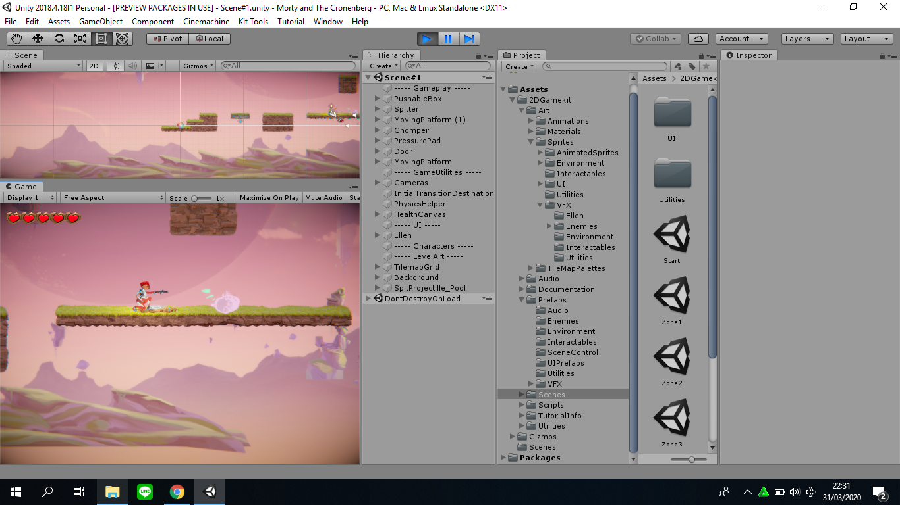
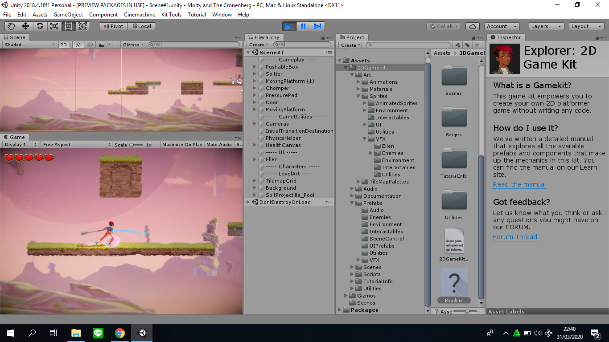
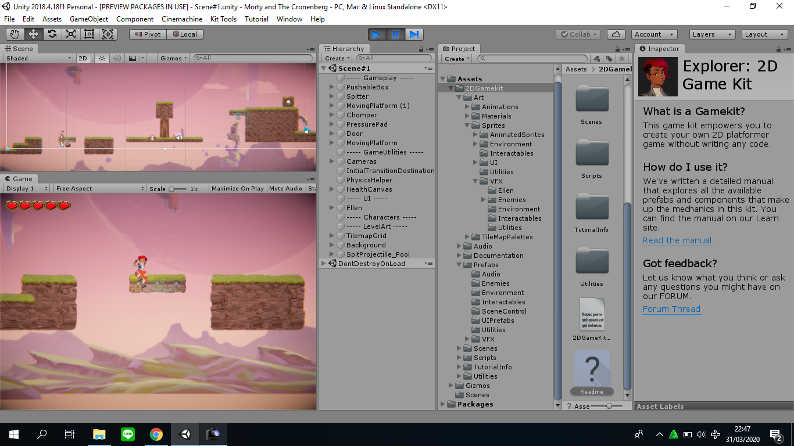

# IF3210-2020-Unity-13517148
A 2D platformer game with wave survival gameplay using Unity.

## Cara Kerja

| Controls | Keyboard |
|----------|----------|
| Move Left | A |
| Move Right | D |
| Jump | Space |
| Crouch | S |
| Lookup | W |
| Shoot | O |
| Melee | K |
| Activate | E |
| Pass Through Platform | S and Space |

## Library

2D Game Kit for Unity

## Screenshot

* Start

* Options

* Move

* Jump

* Crouch

* Shoot

 
 
* Melee

* Pass Through Platform

